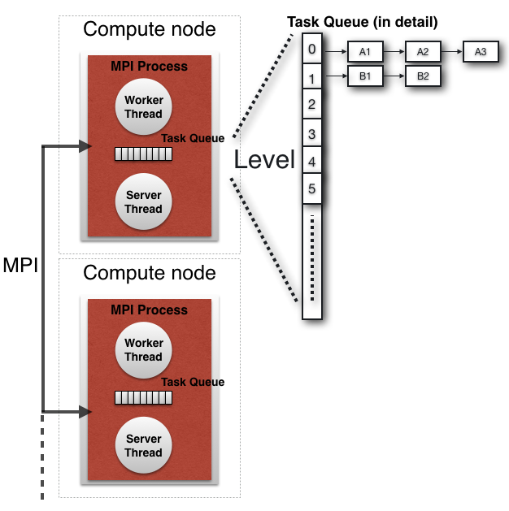
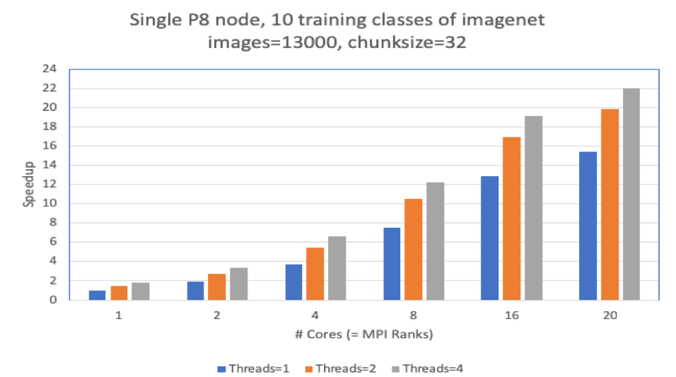

# torcpy: supporting task-based parallelism in Python

## 1. Introduction ##

**torcpy** is a platform-agnostic adaptive load balancing library that orchestrates scheduling of multiple function evaluations on both shared and distributed memory platforms.

As an open-source tasking library, **torcpy**, aims at providing a parallel computing framework that:
- offers a unified approach for expressing and executing task-based parallelism on both shared and distributed memory platforms
- takes advantage of MPI internally in a transparent to the user way but also allows the use of legacy MPI code at the application level
- provides lightweight support for parallel nested loops and map functions
- supports task stealing at all levels of parallelism
- exports the above functionalities through a simple and single Python package

torcpy exports an interface compatible with PEP 3148. Therefore tasks (futures) can be spawned and joined with the *submit* and *wait* calls. A parallel *map* function is provided, while *spmd* allows for switching
to the typical SPMD execution mode that is natively supported by MPI.

## 2. Installation and testing

### 2.1 Installation

Prerequisites: `python3 >= 5` and `pip3`.

```bash
git clone git@github.com:IBM/torc_py.git
cd torc_py
pip3 install .
```

Observation:
The main requirements are *mpi4py* and *termcolor*, while *numpy*, *cma*, *h5py* and *pillow* are needed by some examples.


### 2.2. Testing

We use the file `examples\ex00_masterworker.py` to demonstrate the execution of the tasking library using multiple processes and threads. The task function receives as input a number `x`, sleeps for one second and then computes and returns as result the square value `x*x`. The main task spawns `ntasks` (= four) tasks that are distributed cyclically, by default, to the available workers and then calls `wait`, waiting for their completion. Finally, it prints the task results and reports the elapsed time.

The MPI processes start with the execution of `__main__` and call `torcpy.start(main)`, which initializes the tasking library and then executes the primary application task (with task function `main()`) on the process with rank 0.  

```python
import time
import threading
import torcpy

def work(x):
    time.sleep(1)
    y = x**2
    print("work inp={:.3f}, out={:.3f} ...on node {:d} worker {} thread {}".format(x, y, torcpy.node_id(), torcpy.worker_id(), threading.get_ident()), flush=True)
    return y

def main():
    ntasks = 4
    sequence = range(1, ntasks + 1)

    t0 = torcpy.gettime()
    tasks = []
    for i in sequence:
        task = torcpy.submit(work, i)
        tasks.append(task)
    torcpy.wait()
    t1 = torcpy.gettime()

    for t in tasks:
        print("Received: sqrt({})={:.3f}".format(t.input(), t.result()))

    print("Elapsed time={:.2f} s".format(t1 - t0))

if __name__ == '__main__':
    torcpy.start(main)
```

### 2.3 Execution of tests

#### 2.3.1. One MPI process with one worker

This is similar to the sequential execution of the code with the main difference that the task functions are executed not immediately but in deferred mode. No MPI communication takes place and the tasks are directly inserted in the local queue. Upon `torcpy.wait()`, the current (primary) application task suspends its execution, the scheduling loop of the underlying worker is activated and the child tasks are fetched and executed. When the last child task completes, the primary task resumes and prints the results. Moreover, the tasking library reports how many tasks where created and executed by each MPI process.

```console
$ mpirun -n 1 python3 ex00_masterworker.py
TORCPY: main starts
work inp=1.000, out=1.000 ...on node 0 worker 0 thread 4536538560
work inp=2.000, out=4.000 ...on node 0 worker 0 thread 4536538560
work inp=3.000, out=9.000 ...on node 0 worker 0 thread 4536538560
work inp=4.000, out=16.000 ...on node 0 worker 0 thread 4536538560
Received: sqrt(1)=1.000
Received: sqrt(2)=4.000
Received: sqrt(3)=9.000
Received: sqrt(4)=16.000
Elapsed time=4.03 s
TORCPY: node[0]: created=4, executed=4
```

#### 2.3.2. Two MPI process with one worker each

Two MPI processes (*nodes*) are started with rank 0 and 1, respectively. Each process has a single worker thread, with global id 0 and 1, accordingly. The primary task runs on rank 0 and spawns the four tasks. The first and the third tasks are submitted locally to worker 0 while the second and fourth tasks are send to worker 1.

```console
$ mpirun -n 2 python3 ex00_masterworker.py
TORCPY: main starts
work inp=1.000, out=1.000 ...on node 0 worker 0 thread 4585866688
work inp=2.000, out=4.000 ...on node 1 worker 1 thread 4623332800
work inp=3.000, out=9.000 ...on node 0 worker 0 thread 4585866688
work inp=4.000, out=16.000 ...on node 1 worker 1 thread 4623332800
Received: sqrt(1)=1.000
Received: sqrt(2)=4.000
Received: sqrt(3)=9.000
Received: sqrt(4)=16.000
Elapsed time=2.03 s
TORCPY: node[0]: created=4, executed=2
TORCPY: node[1]: created=0, executed=2
```

#### 2.3.3. One MPI process with two workers

The single MPI process is initialized with two worker threads, with global ids 0 and 1. The four tasks are inserted in the local process queue and extracted and executed by the two workers. The primary task is executed by worker 0 and it is also tied to it, therefore it always continues on the same worker.

```console
$ mpirun -n 1 -env TORCPY_WORKERS=2  python3 ex00_masterworker.py
TORCPY: main starts
work inp=1.000, out=1.000 ...on node 0 worker 0 thread 4607645120
work inp=2.000, out=4.000 ...on node 0 worker 1 thread 123145550958592
work inp=3.000, out=9.000 ...on node 0 worker 0 thread 4607645120
work inp=4.000, out=16.000 ...on node 0 worker 1 thread 123145550958592
Received: sqrt(1)=1.000
Received: sqrt(2)=4.000
Received: sqrt(3)=9.000
Received: sqrt(4)=16.000
Elapsed time=2.02 s
TORCPY: node[0]: created=4, executed=4
```

#### 2.3.4 Two MPI processes with two workers each

There are two MPI processes with two workers each, therefore workers 0 and 1 belong to the process with rank 0 and workers 2 and 3 to rank 1. Since task distribution is performed on a worker basis, the first and the second tasks are submitted locally to node 0 while the third and fourth tasks are send to node 1. Eventually, every worker executes one task and the application is executed 4x times faster.

```console
$ mpirun -n 2 -env TORCPY_WORKERS=2  python3 ex00_masterworker.py
TORCPY: main starts
work inp=2.000, out=4.000 ...on node 0 worker 0 thread 4560111040
work inp=1.000, out=1.000 ...on node 0 worker 1 thread 123145531727872
work inp=4.000, out=16.000 ...on node 1 worker 2 thread 4643915200
work inp=3.000, out=9.000 ...on node 1 worker 3 thread 123145537077248
Received: sqrt(1)=1.000
Received: sqrt(2)=4.000
Received: sqrt(3)=9.000
Received: sqrt(4)=16.000
Elapsed time=1.04 s
TORCPY: node[0]: created=4, executed=2
TORCPY: node[1]: created=0, executed=2
```

## 3. Examples

Please note that the `torcpy` module is imported as `torc` in the following examples.

### 3.1. Submit and wait

The primary task spawns and distributes cyclically 10 tasks to the available workers, waits for their completion and finally prints the results.

```python
import torcpy as torc


def work(x):
    return x * x


def main():
    data = range(10)
    tasks = []
    for d in data:
        tasks.append(torc.submit(work, d))
    torc.wait()
    for t in tasks:
        print(t.result())

if __name__ == '__main__':
    torc.start(main)
```

### 3.2. Parallel map

Equivalent to the previous example but this time using the `map` function with default chunk size equal to 1.

```python
import torcpy as torc

def work(x):
    return x*x

def main():
    data = range(10)
    results = torc.map(work, data)
    print(results)

if __name__ == '__main__':
    torc.start(main)
```    


### 3.3. Simple callback example

Four tasks are spawned and executed by the available workers. When a task completes, it is passed as argument to a callback task that is executed by the worker threads of the node (process) where the parent task is active.

```python
import torcpy as torc
import threading


def cb(task):
    arg = task.result()
    tid = threading.get_ident()
    print("thread {}: callback with arg={}".format(tid, arg), flush=True)


def work(x):
    tid = threading.get_ident()
    y = x * x
    print("thread {}: work inp={}, out={} ... on node {}".format(tid, x, y, torc.node_id()), flush=True)
    return y


def main():
    ntasks = 4
    sequence = range(1, ntasks+1)

    t_all = []
    for i in sequence:
        task = torc.submit(work, i, callback=cb)
        t_all.append(task)
    torc.wait()

    for task in t_all:
        print("Received: {}^2={}".format(task.input(), task.result()))


if __name__ == '__main__':
    torc.start(main)
```


### 3.4. Hierarchical parallelism: recursive Fibonacci

Multiple levels of parallelism are exploited in this commonly used parallelization example of recursive Fibonacci.

```python
import torcpy as torc


def fib(n):
    if n == 0:
        result = 0
    elif n == 1:
        result = 1
    else:
        n_1 = n - 1
        n_2 = n - 2
        if n < 30:
            result1 = fib(n_1)
            result2 = fib(n_2)
            result = result1 + result2
        else:
            task1 = torc.submit(fib, n_1)
            task2 = torc.submit(fib, n_2)
            torc.wait()
            result = task1.result() + task2.result()

    return result


def main():
    n = 35
    result = fib(n)

    print("fib({}) = {}".format(n, result))
```

### 3.5. Calling MPI SPMD code: MPI_Bcast  

The global array `A` is initialized by the primary application task (`main`) on MPI process 0.
Next, the `spmd` function triggers the execution of `bcast_task` on all MPI processes, thus switching
to the SPMD execution model and allowing for direct data broadcast using `Bcast`.

```python
import numpy
import torcpy as torc
from mpi4py import MPI

N = 3
A = numpy.zeros(N, dtype=numpy.float64)


def bcast_task(root):
    global A
    comm = MPI.COMM_WORLD
    # Broadcast A from rank 0
    comm.Bcast([A, MPI.DOUBLE], root=root)


def work():
    global A
    print("node:{} -> A={}".format(torc.node_id(), A))


def main():
    global A

    # primary task initializes array A on rank 0
    for i in range(0, N):
        A[i] = 100*i

    torc.spmd(bcast_task, torc.node_id())  # 2nd arg (root) is 0 and can be omitted

    torc.spmd(work)
```


### 3.6. Reduction operation using callbacks

In this example, the callback function adds the task result to a global variable, implementing thus
a reduction operation. This example assumes that a single worker thread per MPI process is used and that callbacks are instantiated as tasks that are executed by worker threads.

```python
import torcpy as torc

sum_v = 0


def cb(task):
    global sum_v
    arg = task.result()
    sum_v = sum_v + arg


def work(x):
    y = x ** 2
    return y


def main():
    data = range(10)

    tasks = []
    for d in data:
        t = torc.submit(work, d, callback=cb)
        tasks.append(t)

    torc.wait()
    print("Sum=", sum_v)


if __name__ == '__main__':
    torc.start(main)
```


### 3.7. Late switch from SPMD to master-worker and image preprocessing

```python
import os
import sys
import time
from PIL import Image
import torcpy as torc

files = []


def get_files(path):
    all_files = []
    for dirpath, dirnames, filenames in os.walk(path):
        for f in filenames:
            if f.endswith('.jpg') | f.endswith('.JPEG') | f.endswith('.png'):
                all_files.append(os.path.join(dirpath, f))

    return sorted(all_files)


def work(i):
    global files
    f = files[i]
    im = Image.open(f)
    im = im.resize([32, 32])
    im.close()
    return None


def main():
    global files

    # SPMD execution: torcpy and MPI initialization
    torc.init()

    # SPMD execution: common global initialization takes place here
    if len(sys.argv) == 1:
        if torc.node_id() == 0:
            print("usage: python3 {} <path>".format(os.path.basename(__file__)))
        return

    files = get_files(sys.argv[1])

    # Switching to master-worker
    torc.launch(None)

    t0 = time.time()
    _ = torc.map(work, range(len(files)))
    t1 = time.time()
    print("t1-t0=", t1-t0)

    torc.shutdown()


if __name__ == "__main__":
    main()
```

### 3.8. Parallel numerical optimization

```python
import cma  # python package for numerical optimization
import torcpy as torc

def rosenbrock(x):
    """Rosenbrock test objective function"""
    n = len(x)
    if n < 2:
      raise ValueError('dimension must be greater one')
    return sum(100 * (x[i]**2 - x[i+1])**2 + (x[i] - 1)**2 for i in range(n-1))

def main():
    es = cma.CMAEvolutionStrategy(2 * [0], 0.5, {'popsize':8})
    while not es.stop():
        solutions = es.ask()
        es.tell(solutions, torc.map(rosenbrock, solutions))
        es.logger.add(es)  # write data to disc to be plotted
        es.disp()

    cma.plot()
```


### 3.9. Demonstration of work stealing

All 16 tasks are submitted by the primary task, running on node 0, to the worker thread of rank 1.
The idle workers that find the local queue empty, issue steal requests and eventually retreive a task from the queue of rank 1. The primary task resumes when all the child tasks have completed and their results are available on rank 0.

```python
import time
import torcpy as torc


def work(x):
    time.sleep(1)
    y = x*x
    print("taskfun inp={}, out={} ...on node {:d}".format(x, y, torc.node_id()), flush=True)
    return y


def main():
    nodes = torc.num_nodes()
    if nodes < 2:
        print("This examples needs at least two MPI processes. Exiting...")
        return
    local_workers = torc.num_local_workers()
    if local_workers > 1:
        print("This examples should use one worker thread per MPI process. Exiting...")
        return

    ntasks = 16
    sequence = range(1, ntasks + 1)

    t0 = torc.gettime()
    t_all = []
    for i in sequence:
        try:
            task = torc.submit(work, i, qid=1)
            t_all.append(task)
        except ValueError:
            print("torc.submit: invalid argument")

    torc.enable_stealing()
    torc.wait()
    t1 = torc.gettime()
    torc.disable_stealing()

    for task in t_all:
        print("Received: {}^2={}".format(task.input(), task.result()))

    print("Elapsed time={:.2f} s".format(t1 - t0))


if __name__ == '__main__':
    torc.start(main)
```


## 4. Application Programming Interface

### 4.1. Task management routines

- `submit(f, *args, qid=-1, callback=None, **kwargs)`:
submits a new task that corresponds to the asynchronous execution of function `f()` with input arguments `args`. The task is submitted to the worker with global identifier `qid`. If `qid` is equal to -1, then cyclic distribution of tasks to processes is performed. The `callback` function is called on the rank that spawned the task, when the task completes and its results have been returned to that node.
- `map(f, *seq, chunksize=1)`: executes function `f()` on a sequence (list) of arguments.
It returns a list with the results of all tasks. It is similar to the `map()` function of Python and other packages, allowing for straightforward usage of existing codes.
- `wait(tasks=None)`: the current task waits for all its child tasks to finish. The underlying worker thread is released and can execute other tasks.
- `as_completed(tasks=None)`: similar to `wait` but returns the finished child tasks in the order they completed their execution.

### 4.2. Application setup

- `start(f)`: initializes the library, launches function `f()` on process with rank 0 as the primary application task. When `f()` completes, it shutdowns the library. It is a collective function that must be called within `__main__`.

```python
if __name__ == '__main__':
    torcpy.start(main)
```

### 4.3. Low-level application setup

- `init()`: initializes the tasking library.
- `launch(f)`: launches function `f()` as primary application task on the MPI process with rank 0. It is a collective call that must be called by all MPI processes. If `f == NULL` then the function returns on rank 0 but activates the scheduling loop of the main worker thread on all other MPI processes. Therefore, the current function becomes the primary application task running on rank 0.
- `shutdown()`: shutdowns the tasking library.

### 4.4. MPI code

- `spmd(f, *args)`: executes function `f()` on all MPI processes. It allows for dynamic switching from the master-worker to the SPMD execution mode, allowing thus legacy MPI code to be used within the function.

### 4.5. Additional calls

- `enable_stealing(), disable_stealing()`: control task stealing between MPI processes.
- `gettime()`: current time in seconds (float).
- `worker_id(), num_workers()`: return the global worker thread id and the total number of workers.
- `node_id(), num_nodes()`: return the rank of the calling MPI process and the number of MPI processes.

### 4.6 Context manager

### 4.7. Environment variables

- `TORCPY_WORKERS` (integer): number of worker threads used by each MPI processor. Default value is 1.
- `TORCPY_STEALING` (boolean): determines if internode task-stealing is enabled or not. Default value is "False".
- `TORCPY_SERVER_YIELDTIME` (float): for how many seconds an idle server thread will sleep releasing the processor. Default value in 0.01.
- `TORCPY_WORKER_YIELDTIME` (float): for how many seconds an idle worker thread will sleep releasing the processor. Default value in 0.01.


## 5. Design and architecture

The library is implemented on top of MPI and multithreading and it can considered as the pure Python implementation of the [*TORC*](https://github.com/phadjido/torc_lite) C/C++ runtime library [Hadjidoukas:2012], a software package for programming and running unaltered task-parallel programs on both shared and distributed memory platforms. The library supports platform agnostic nested parallelism and automatic load balancing in large scale computing architectures. It has been used at the core of the [Π4U](https://github.ibm.com/cselab/pi4u) framework [Hadjidoukas:2015], allowing for HPC implementations, for both multicore and GPU clusters, of algorithms such as Transitional Markov Chain Monte Carlo (TMCMC) and Approximate Bayesian Computational Subset-simulation.

*torcpy* is mainly built on top of the following third-party Python packages: *mpi4py*, *threading*, *queue*.
Tasks are instantiated as Python dictionaries, which introduce less overhead than objects. The result of the task function is transparently stored in the task descriptor (future) on the MPI process that spawned the task. According to PEP 3184, the result can be then accessed as `task.result()`. Similarly, the input parameters can be accessed as `task.input()`.

All remote operations are performed asynchronously through a server thread. This thread is responsible for:
- inserting incoming tasks to the local queue of the process
- receiving the completed tasks and their results
- serving task stealing requests

The internal architecture of *torcpy* is depicted in the following figure:




## 6. Performance evaluation

TORC, the C/C++ counterpart of torcpy has been used extensively on small and large scale HPC environments
such as the Euler cluster (ETH) and the Piz Daint (CSCS) supercomputer. TORC has been used to orchestrate the scheduling of function evaluations of the TMCMC method within Π4U on multiple cluster nodes. The TMCMC method was able to achieve an overall parallel efficiency of more than 90% on 1024 compute nodes of Piz Daint running hybrid MPI+GPU molecular simulation codes with highly variable time-to-solution between simulations with different interaction parameters.

### 6.1. Preprocessing of image datasets

A typical preprocessing stage of Deep Learning workloads includes the transformation of datasets of raw images to a single file in HDF5 format. The images are organized in subfolders, where the name of each subfolder denotes the label of the enclosed images. For each image, the file is opened and the binary data are loaded to a buffer (numpy array). This operations includes data decompression if the image is stored in JPEG format. Then, the image is resized and rescaled and additional preprocessing filters might be also applied. Finally, the result is written to an HDF5 file, that we will be used at the training phase of deep learning.

```python
def process_train_image(i, target_dim):
    global reader, pipe

    # load the image and its label
    im, label = reader.get_train_image(i)        

    # apply preprocessing filters
    im = pipe.filter(im)

    # resize accordingly
    dx = image_to_4d_tensor(im, target_dim)
    dy = label

    # return results
    return dx, dy
```

The parallelization of the sequential for loop is performed with the map function, using a chunk size of 32 so as to reduce the number of spawned tasks.

```python
sequence_i = range(n_train)
sequence_t = [target_dim] * n_train

# parallel map with chunksize
task_results = torcpy.map(process_train_image, sequence_i, sequence_t, chunksize=32)

# write the results to the HDF5 dataset
i = 0
for t in task_results:
    dx, dy = t
    dataset_x[i, :, :, :] = dx
    dataset_y[i] = dy
    i = i+1
```

### 6.2. Results

[Imagenet](http://www.image-net.org/) is very large dataset of 1000 classes, each with 1300 images stored in JPEG format. We preprocess the images of 10 training classes of the Imagenet dataset. We perform our experiments on a single IBM Power8 node equipped with 20 cores and 8 threads each. The software configuration includes Python 3.5, mpi4py/3.0.1 and OpenMPI/3.1.2.

We spawn a single MPI process per core and then utilize 1,2 and 4 workers per process. The command for running the benchmark for various numbers of processes (*NR*) and local workers (*NW*) on the specific computing platform is as follows:

```console
mpirun -n $NR -x TORCPY_WORKERS=$NW --bind-to core --map-by socket --mca btl self,tcp  python3 benchmark.py
```

The measurements include the time for spawning the parallelism, executing the preprocessing in parallel and waiting for the completion of all tasks, i.e. collecting the results back. We observe that the application exhibits good scaling and achieves ~78% efficiency when 20 processes of one worker thread each are used. The performance does not scale linearly with the number of cores as image decompression and processing stress the memory subsystem of the node. We also observe that multithreading further improves the performance, allowing for a maximum achieved speedup of 22x (20 processes, 4 threads).




## 7. Related work ##

There is a number of Python packages and framework that enable the orchestration and execution of task-based parallelism on various computing platforms. On single-node multi-core systems Python provides two packages: the [*multiprocessing*](https://docs.python.org/3/library/multiprocessing.html) and the [*concurrent.futures*](https://docs.python.org/3/library/concurrent.futures.html). The [*futures* package of *mpi4py*](https://mpi4py.readthedocs.io/en/stable/mpi4py.futures.html) provides an extension of *futures* on top of the MPI programming model. [*DTM*](http://deap.gel.ulaval.ca/doc/0.9/api/dtm.html) is an MPI-based framework that supports task-based parallelism. However, *DTM* is obsolete and has been replaced by [*Scoop*](http://pyscoop.org), which follows a more distributed-based approach without relying on MPI. This is also the case for the [*Celery*](http://www.celeryproject.org/) and [*Dask*](http://dask.pydata.org/en/latest/) frameworks, which mainly target cloud computing environments. Finally, [*PycompSS*](https://pypi.org/project/pycompss/) is a compiler-based approach, where task functions and code parallelization is based on annotations.    


|Framework           | Clusters | Nested parallelism           | MPI |
|--------------------|----------|------------------------------|-----|
| *multiprocessing*  | No       | No                           | No  |
| *futures*          | No       | No                           | No  |
| *mpi4py.futures*   | Yes      | No                           | No  |
| *dtm (deap 0.9.2)* | Yes      | Inefficiently (threads)      | Yes |
| *scoop (0.7.1.1)*  | Yes      | Yes, coroutines              | No  |
| *celery (4.2.0)*   | Yes      | No                           | No  |
| *dask (1.2.2)*     | Yes      | Inefficiently (more workers) | No  |
| *pycompss (2.4)*   | Yes      | Yes                          | No  |
| **torcpy**         | Yes      | Yes                          | Yes |


## Authors and contacts
 - Panagiotis Chatzidoukas, IBM Research - Zurich, hat@zurich.ibm.com
 - Cristiano Malossi, IBM Research - Zurich, acm@zurich.ibm.com
 - Costas Bekas, IBM Research - Zurich, bek@zurich.ibm.com

## Acknowledgments

We would like to thank our colleagues in the IBM OCL team: Roxana Istrate, Florian Scheidegger, Andrea Bartezzaghi and Nico Gorbach.
This work was supported by VIMMP (Virtual Materials Marketplace Project) (Horizon 2020, GA No 760907).

## References

[Hadjidoukas:2012] A Runtime Library for Platform-Independent Task Parallelism. PDP 2012: 229-236. 2011
[[DOI]](https://doi.org/10.1109/PDP.2012.89)  
[Hadjidoukas:2015] "Π4U: a high performance computing framework for Bayesian uncertainty quantification of complex models"," Journal of Computational Physics, 284:1–21, 2015. [[DOI]](https://doi.org/10.1016/j.jcp.2014.12.006)
